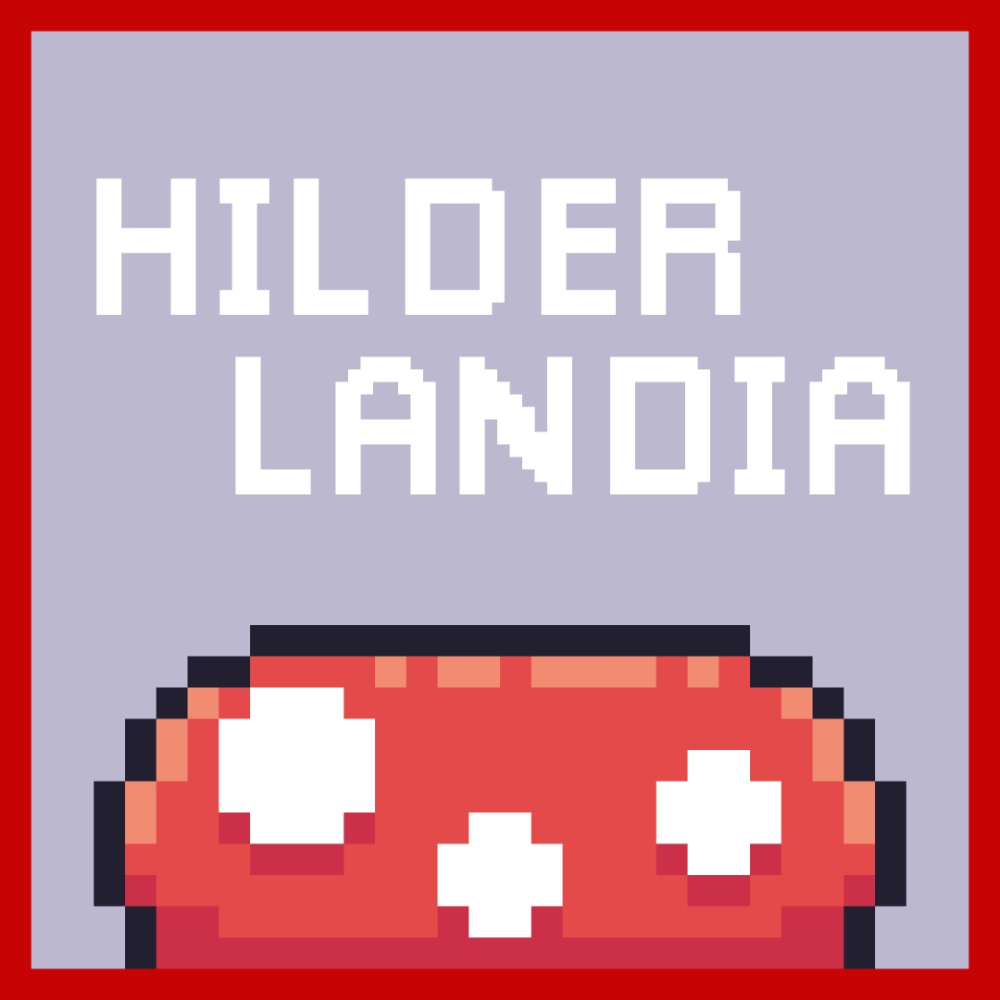

  <h1> Hilderlandia </h1>
  

 

  

    Um jogo simples de plataforma 2D em pixel art, criado com o objetivo de treinar a programação orientada a objetos (POO) em C# e praticar o desenvolvimento na Unity. 
    Toda a programação foi realizada por mim, enquanto os assets são de autoria do talentoso <a href="https://pixelfrog-assets.itch.io/">PixelFrog</a>, que disponibiliza 
    seu trabalho gratuitamente na internet.
  

  

    
  

**(APK Android) Baixe em:**

**Tecnologias Utilizadas:**

## Contato

